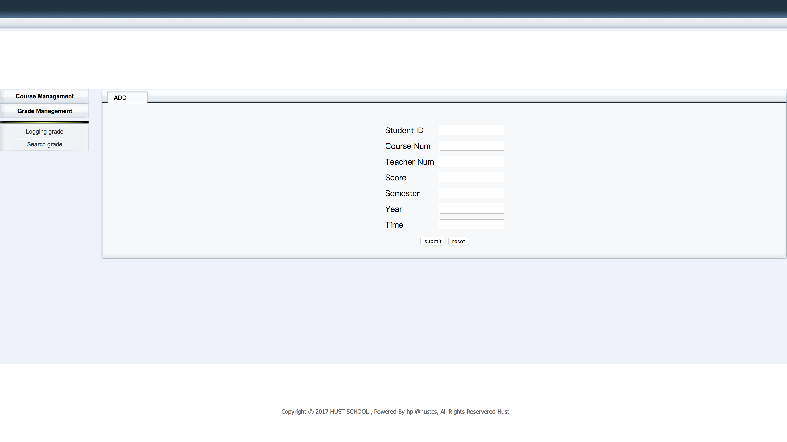
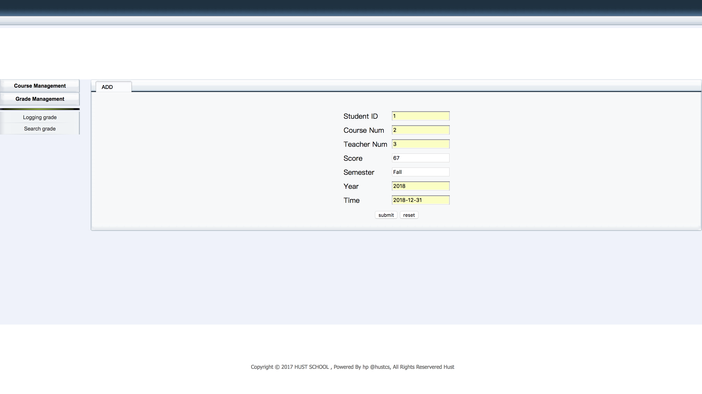
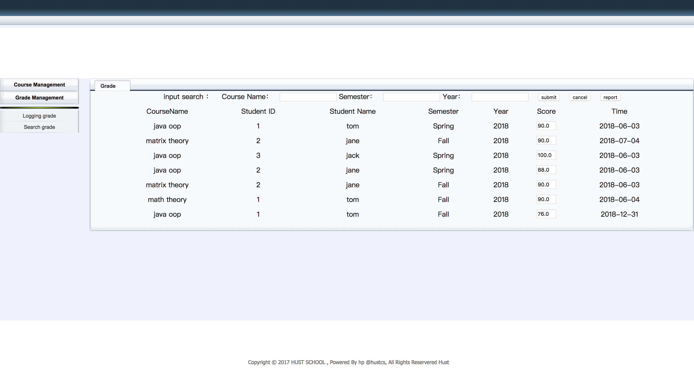
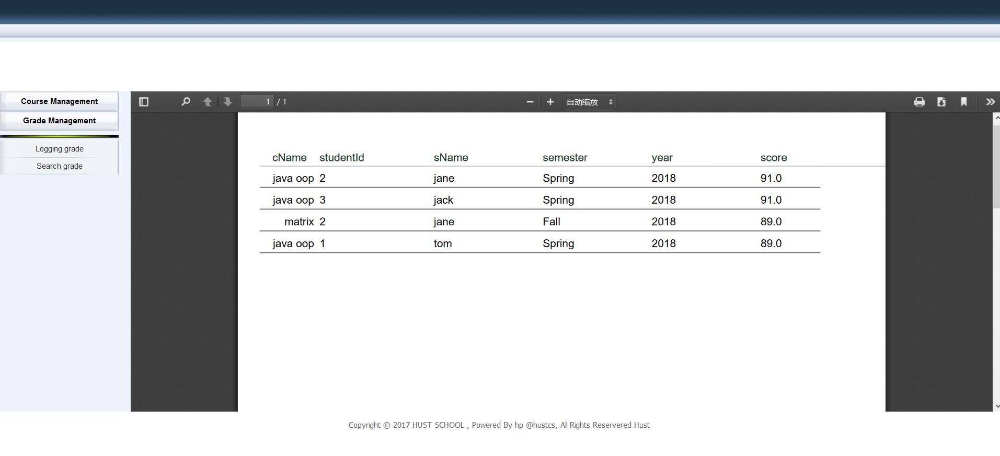
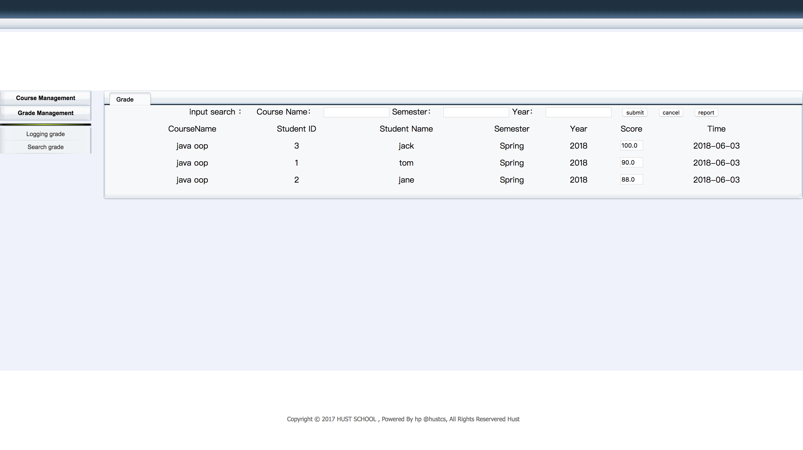
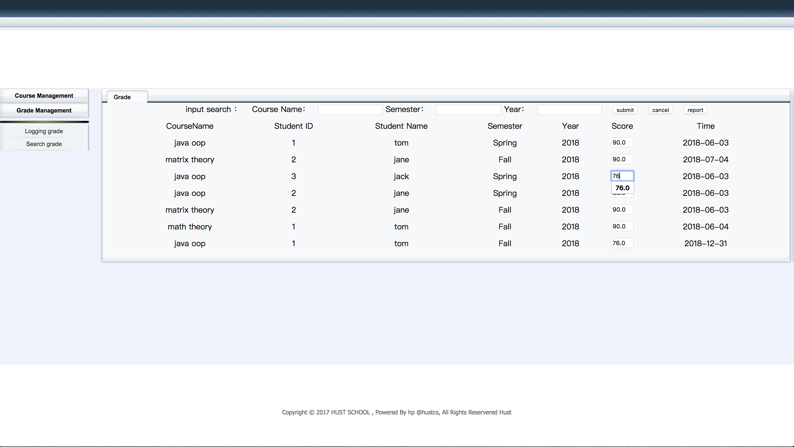
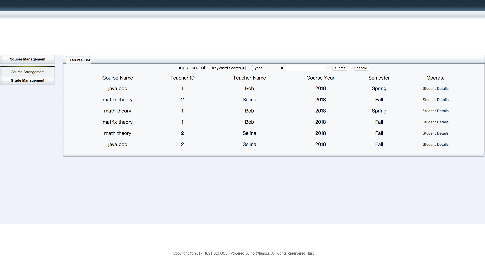
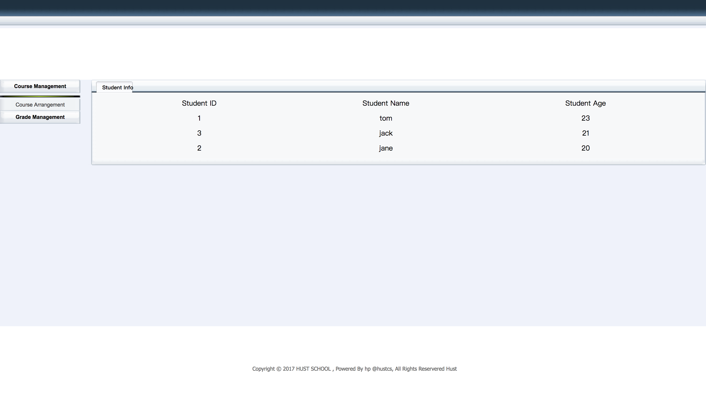

 # 5.4 Front-end interface and screenshoot

We implement our system based on Java Web. After the development and deployment, now we can see this project on the [site](http://119.29.161.49:8080/teacher/).

According to the desciption of our business, we have the follow requirements

- check in the scores of students
- query the score with  some filters
- modify scores of students 
- query course

##1.check in the scores of students 

 We enter the correct infomation of one student, the backend database will store it.

Now we can see the record that we just check in.

## 2.Query score

We can do some query on the students score even with some filters. Further more, we can export the score report (in pdf) of one class or all the student.

Here is the report.pdf

Some filter or keywords are also supported.

## 3.Modify the score

Errors are inevitable. So we can modify the score when we do the query on student score.

## 4. Query course

Teacher can query the course arrangement and students who choose this course.

Just click on the detail and students will show up.

 

