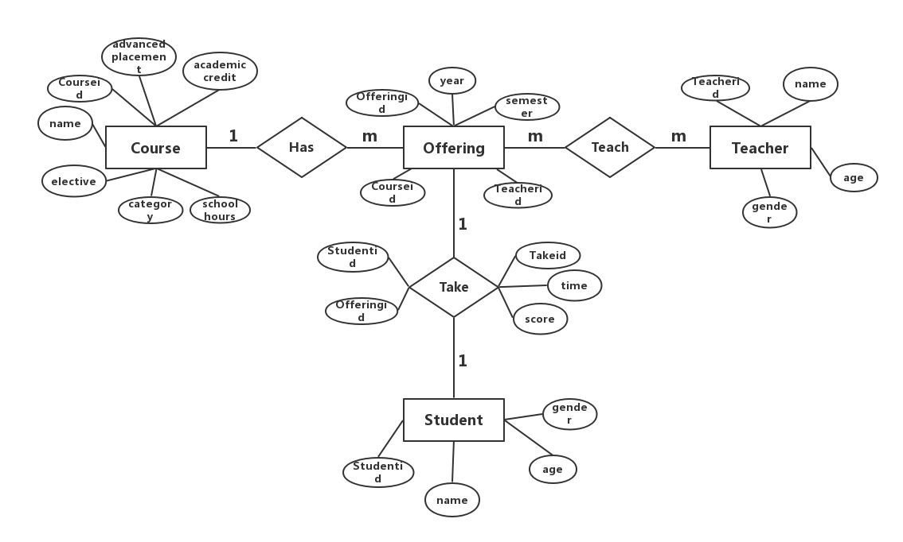

ER图各项描述：
- Course（Courseid,advanced placement,academic credit,elective,category,school hours）
    
        Courseid:课程编号
        advanced placement:先修课
        academic credit:学分
        elective:选修还是必修
        category:类别（公选还是专业课）
        school hours:学时

- Offering(Offeringid,Courseid,Teacherid,year,semester)

        Offeringid:学期课程编号
        Courseid:课程编号
        Teacherid:教师编号
        year:课程年份
        semester:学期（春或秋）

- Teacher(Teacherid,name,gender,age)

        Teacherid:教师编号
        name:姓名
        gender:性别
        age:年龄

- Student(Studentid,name,gender,age)

        Studentid:学生编号
        name:姓名
        gender:性别
        age:年龄

- Take(Takeid,Studentid,Offeringid,time,score)

        Takeid:（学生）上课编号
        Studentid:学生编号
        Offeringid:学期课程编号
        time:录入成绩时间
        score:成绩

# 业务描述
## 成绩录入
每次考试后，各个任课老师把各学生的该科成绩录入，录入信息包括学生姓名、学号、科目、成绩、录入日期。

## 成绩查询
根据多个关键字对学生的成绩进行查询，还可以统计得到一个班的平均成绩报表和所有学生的排名。

## 成绩修改 
如果在审卷过程中发现有成绩错误，可以对学生的成绩进行修改。

## 课程查询
教师查看自己的课程安排以及所在课程对应的学生